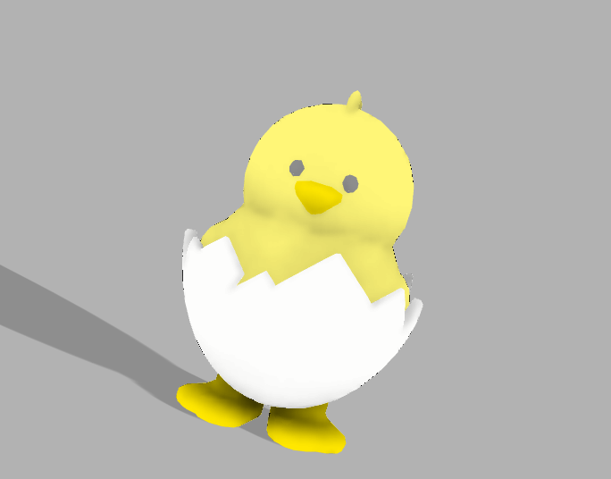
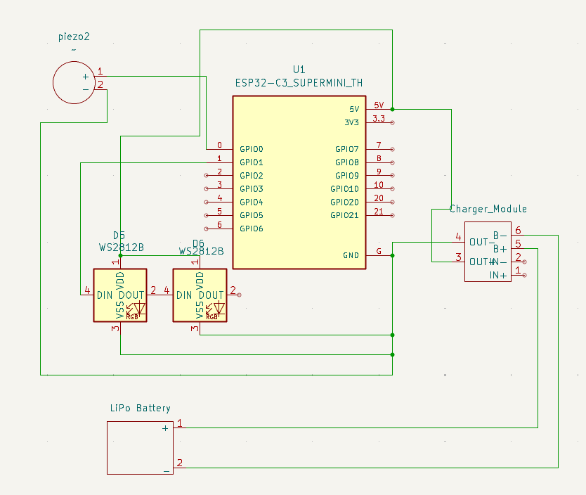
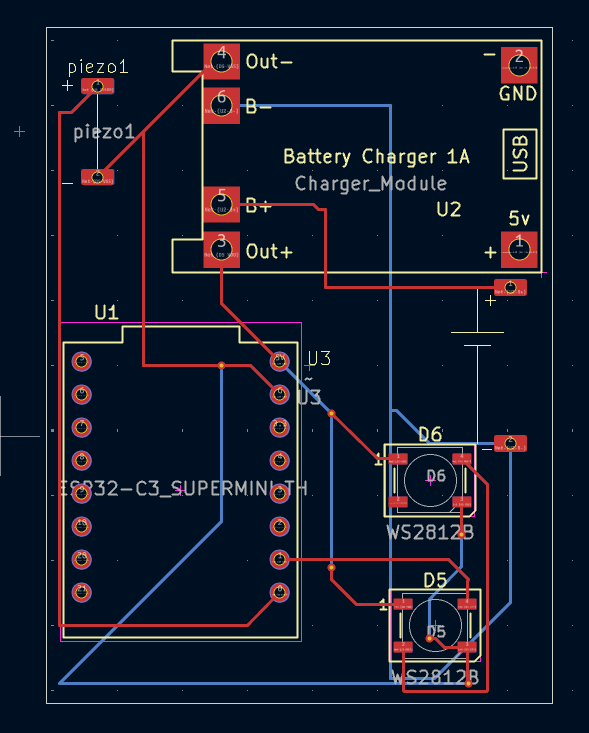
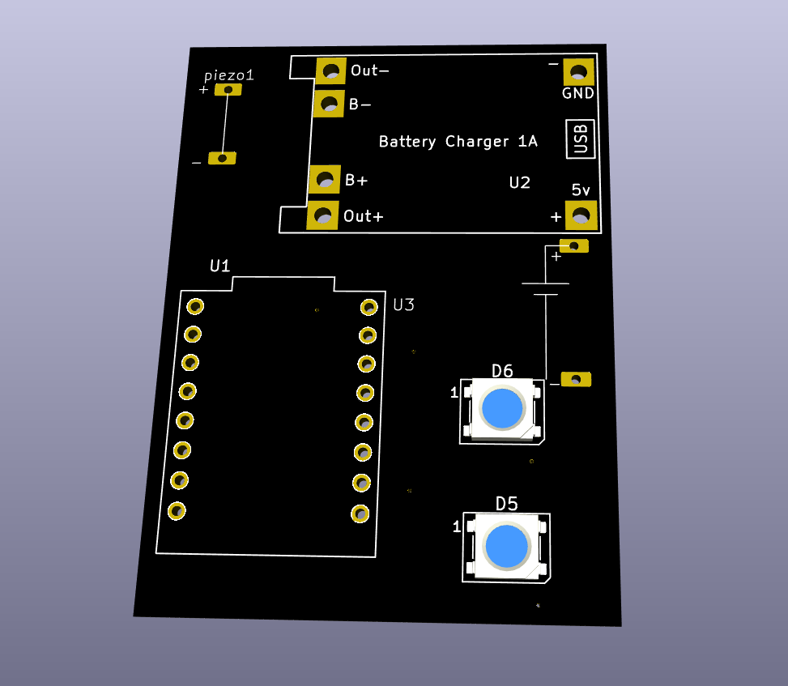
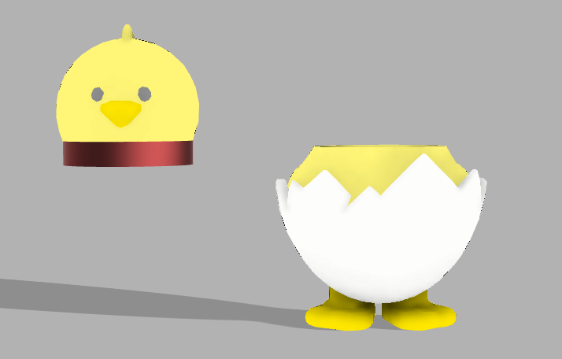

# CHICHI - The Slap-Reactive Smart Lamp

CHICHI is a portable smart lamp shaped like a newly hatched chick in a cracked egg. It brings warm ambient light and playful personality wherever you go — responding to your touch with vibrant colors and breathing effects that make it feel alive.

## Why CHICHI?

In a world of cold screens and rigid devices, CHICHI brings warmth and emotion to your workspace or bedside. It's not just a lamp — it's a companion that responds to you, glows with you, and adds a touch of playfulness to your day. Whether you need focus lighting, a mood boost, or just something cute to brighten your desk, CHICHI is there.

## Features

- **Gesture-Controlled** - No buttons needed, just slap or tap
- **Adorable Design** - Shaped like a chick hatching from an egg
- **RGB LEDs** - WS2812B addressable LEDs for smooth animations
- **Portable & Rechargeable** - Built-in Li-Po battery with USB-C charging
- **Smart Interactions**:
  - **Single Slap** - Change colors
  - **Double Slap** - Power ON/OFF
  - **Idle Mode** - Soft breathing glow when untouched
- **Expandable** - ESP32-C3 with Wi-Fi & Bluetooth LE for future features
- **Compact & Cute** - Translucent 3D-printed shell with diffused lighting

## Schematic

The circuit is built around the ESP32-C3 Supermini microcontroller with:
- 2x WS2812B addressable RGB LEDs in series (D5 → D6)
- Piezo disc sensor connected directly to ESP32 GPIO
- Battery Charger 1A module with USB input
- LiPo battery providing power to entire system
- Simple, compact design with minimal external components

## PCB Design

Custom PCB designed for compact integration inside the egg shell:
- 2 WS2812B LEDs (D5 and D6) for efficient lighting
- ESP32-C3 Supermini module headers
- Battery Charger 1A module integration
- Piezo sensor connection pads
- LiPo battery connector

## Case Design

The 3D-printed case features:
- Translucent white PLA/PETG for frosted glow effect
- Two-piece egg design (cracked shell aesthetic)
- Internal cavity for PCB and battery
- Smooth surface finish for even light diffusion
- Compact size: 60-90mm tall (customizable)
- added a cyylinder to be able to open case easily.

Here's your updated BOM with prices and links:

## Bill of Materials (BOM)
| Component | Quantity | Price (INR) | Price (USD) | Link | Notes |
|-----------|----------|-------------|-------------|------|-------|
| ESP32-C3 Super Mini Dev Board | 1 | ₹249 | ~$3.00 | https://hubtronics.in/esp32-c3-super-mini-unsoldered?gad_source=1&gad_campaignid=22872103083&gbraid=0AAAAAD07y2daEUBDnuhJB0-3Eric8vzjN&gclid=CjwKCAiAl-_JBhBjEiwAn3rN7YRKA1vZ0fO1eb1FXJZS9X17QkaaFzzzENmHHNqNpg5i2XCcV6xIixoClmYQAvD_BwE | USB-C ESP32-C3 (shipping included) |
| WS2812B 5050 RGB LED Module | 2 | ₹16 | ~$0.19 | https://robu.in/product/sme-ws2812b-2020-addressable-rgb-pixel-led-worldsemi/?gad_source=1&gad_campaignid=17427802703&gbraid=0AAAAADvLFWdVZtRFmuZUVUdB3Vk_Cy1_z&gclid=CjwKCAiAl-_JBhBjEiwAn3rN7VQExptweZt_n9pNyBL5iHyxQKYkiyiE-ruWIlestUp_9RDfLFDnmhoCBksQAvD_BwE | Individually addressable LEDs |
| Piezoelectric Disc Sensor | 1 | ₹49 | ~$0.59 | https://electronicspices.com/product/35-mm-diameter-piezoelectric-sensor-plate-pack-of-5pcs | Very cheap single piezo disc |
| TP4056 Type-C Charging Module | 1 | ₹40 | ~$0.48 | https://robocraze.com/products/tp4056-battery-charger-c-type-module-with-protection-1?_pos=1&_sid=7bd707613&_ss=r | 1A Li-ion charger with protection |
| Li-Po Battery 3.7V 800mAh | 1 | ₹150 | ~$1.81 | https://quartzcomponents.com/products/3-7v-800mah-li-po-rechargeable-battery?_pos=1&_sid=3c18f12c0&_ss=r | Same capacity, much cheaper |
| MT3608 DC-DC Boost Converter | 1 | ₹35 | ~$0.42 | https://robokits.co.in/power-supply/dc-dc-power-supply/dc-dc-boost-25v-2a-mt3608 | Step-up to stable 5V |
| Custom PCB | 1 | ₹840 | ~$10.12 | - |  |
| 3D Printed Shell | 1 set | ₹420 | ~$5.06 | - |  |

---

### **Total Estimated Cost:**
- **₹1,799** (INR)
- **$21.67** (USD)

**Note:** Currency conversion based on approximate rate of ₹84 = $1 USD
BOM csv: [here!](https://github.com/jai-git4208/chichi/blob/main/resources/bom.csv)

## Interaction Modes

### Single Slap - Color Change(need to add btw)
A gentle slap on the shell cycles through vibrant color modes:
- **Warm White** - Cozy ambient lighting
- **Cool White** - Focus and productivity
- **Red Glow** - Evening/night mode
- **Blue Wave** - Calm and serene
- **Green Pulse** - Nature vibes
- **Purple Dream** - Creative energy
- **Rainbow Fade** - Playful and dynamic
- **Breathing Mode** - Slow pulsing (any color)

### Double Slap - Power Toggle
Two quick slaps turn CHICHI on or off. The LEDs fade smoothly to preserve battery and provide satisfying feedback.

### Idle Mode - Breathing Glow
When left alone, CHICHI breathes with a soft, warm glow — making it feel alive even when you're not interacting with it. Perfect for ambient mood lighting.

## Technical Specifications

### Power System
- **Battery**: 3.7V Li-Po (500-1200 mAh)
- **Charging**: Battery Charger 1A module via USB (5V input)
- **Runtime**: 3-6 hours depending on brightness
- **Power Distribution**: Direct battery power to ESP32 and LEDs
- **Deep Sleep**: Ultra-low power consumption when idle

### Microcontroller
- **Model**: ESP32-C3 Supermini
- **Core**: RISC-V single-core (32-bit)
- **Features**: Wi-Fi 802.11b/g/n, Bluetooth LE 5.0
- **Programming**: Arduino IDE / CircuitPython support
- **GPIO**: Digital I/O for LEDs and piezo sensor
- **Power**: 3.3V operation with onboard regulation

### Lighting Engine
- **LEDs**: 2x WS2812B addressable RGB (D5, D6)
- **Arrangement**: Series connection for synchronized lighting
- **Control**: Single data line from ESP32 GPIO
- **Voltage**: 5V LEDs powered by battery
- **Effects**: Solid colors, transitions, breathing, animations
- **Brightness**: Software-controlled PWM

### Sensor System
- **Type**: Piezo disc vibration sensor (piezo2)
- **Size**: 27-35mm diameter
- **Connection**: Direct to ESP32 GPIO
- **Detection**: Tap, slap, and pressure events
- **Signal Processing**: Software debouncing and threshold detection

## Design Files

- **PCB**: KiCad project files in `PCB/` folder
- **Case**: STEP and STL files in `CAD/` folder  
- **Firmware**: Arduino code in `Firmware/` folder
- **Resources**: Schematics and images in `resources/` folder

## Preferences

- **Shell Color**: Translucent White (frosted)
- **LED Ring**: Warm white base with RGB accents
- **Charging Port**: USB-C (accessible from bottom)

## Credits

Designed and built for the Hack Club Blueprint program.

**Designer**: JAIMIN PANSAL  
**GitHub**: [jai-git4208](https://github.com/jai-git4208)  
**License**: MIT

---

## With ❤️ by Jaimin

*"CHICHI isn't just a lamp — it's a little friend that glows with you."*
